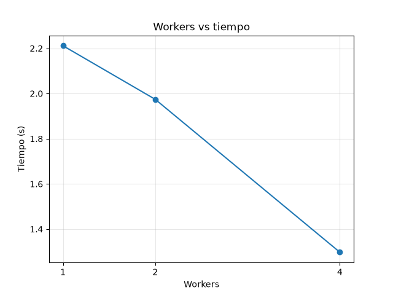
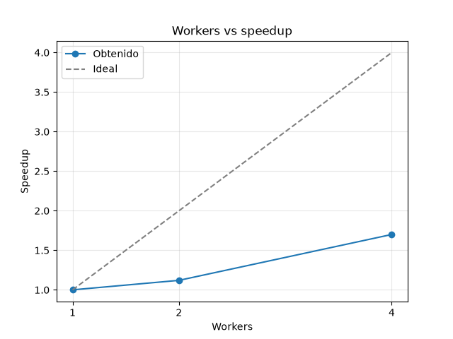
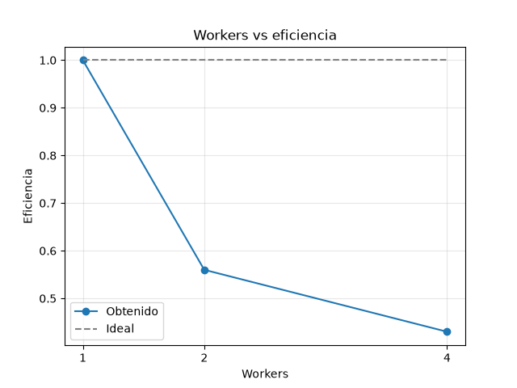

# Proyecto HPC - Primer Parcial (Moya-Moya)

## Descripción
Proyecto de Alto Rendimiento (HPC) que compara el procesamiento secuencial y paralelo utilizando Python (`concurrent.futures.ProcessPoolExecutor`) para evaluar el rendimiento, speedup y eficiencia al aplicar una función matemática sobre un conjunto de datos masivo.

## Requisitos
- Python 3.11 o superior
- Módulos de la librería estándar (math, random, time, concurrent.futures)
- matplotlib (para las gráficas)

## Estructura del Proyecto
- src/operacion.py: Define la función matemática f(x).
- src/datos.py: Genera un conjunto de datos aleatorios con semilla fija.
- src/secuencial.py: Módulo de procesamiento secuencial.
- src/paralelo.py: Módulo de procesamiento paralelo con ProcessPoolExecutor.
- main.py: Punto de entrada para probar la versión secuencial y medir tiempos.
- test_paralelo.py: Verifica que la versión paralela dé el mismo resultado que la secuencial.
- experimentos.py: Mide los tiempos con 1, 2 y 4 workers y guarda resultados/resumen.csv.
- graficas.py: Genera las gráficas de tiempo, speedup y eficiencia en resultados/.

## Cómo ejecutarlo
```
python3 main.py
python3 test_paralelo.py
python3 experimentos.py
python3 graficas.py
```

## GitFlow
GitFlow es un modelo de ramificación (*branching*) para Git que define una estructura estricta de ramas basada en roles para gestionar el desarrollo de software de forma organizada:
- **`main`**: Contiene exclusivamente código estable y listo para producción.
- **`develop`**: Funciona como la rama principal de integración para todas las funcionalidades.
- **`feature/*`**: Ramas individuales creadas a partir de `develop` para desarrollar características específicas de manera aislada antes de integrarse vía Pull Request.

---

### Resultados (Parte 3)

10 millones de datos, promedio de 3 corridas por configuración (`python experimentos.py` y `python graficas.py`).

| Versión | Tiempo (s) | Speedup | Eficiencia |
|---|---|---|---|
| Secuencial | 2.24 | – | – |
| 1 worker | 2.21 | 1.00 | 1.00 |
| 2 workers | 1.97 | 1.12 | 0.56 |
| 4 workers | 1.30 | 1.70 | 0.43 |





#### 1. ¿La ejecución paralela fue más rápida que la secuencial?
Sí, pero no hubo mucha diferencia. La versión secuencial fue de 2.24 s, con 2 workers bajó a 1.97 s y con 4 a 1.3 s, casi la mitad del tiempo. Con 1 fue casi lo mismo que la secuencial, 2.21 s, porque no repartió el trabajo.

#### 2. ¿Qué número de workers obtuvo el menor tiempo?
4 workers, con 1.3 segundos en promedio.

#### 3. ¿Duplicar el número de workers duplicó el rendimiento? ¿Por qué?
No. De 1 a 2 workers solo subió a 1.12 y de 2 a 4 subió a 1.7; lo ideal serían 4. Por eso la eficiencia bajó a 0.56 con 2 y a 0.43 con 4. Esto es porque también repartir los trabajos cuesta cierta eficiencia, y se deben crear los procesos, y esto gasta tiempo.

---

### Análisis y Preguntas Teóricas (Parte 2)

#### 4. ¿Por qué el problema seleccionado puede paralelizarse?
El problema es **completamente independiente (Embarrassingly Parallel)**. La función $f(x)$ se calcula individualmente para cada número $x_i$ dentro del arreglo, sin depender de iteraciones previas o posteriores ni requerir estados compartidos en memoria. Esto permite dividir la lista de datos en $N$ bloques independientes, procesar cada bloque simultáneamente en un núcleo de CPU distinto y reducir las sumas parciales en una suma global final.

#### 5. ¿En qué momento agregar más workers deja de ser beneficioso?
Agregar más *workers* deja de ser beneficioso cuando:
1. **Límite de núcleos físicos:** El número de *workers* excede la cantidad de hilos/núcleos lógicos del procesador, lo que provoca competencia por CPU y sobrecarga por cambios de contexto (*context switching*).
2. **Sobrecarga de comunicación e IPC (Ley de Amdahl):** La creación de procesos con `ProcessPoolExecutor` requiere la serialización de datos (*pickling*) y la clonación del intérprete de Python. Cuando el costo de transferir y sincronizar los bloques supera el tiempo de cálculo real, el rendimiento se estanca o empeora.

#### 6. ¿Qué limitaciones tiene el hardware utilizado?
- **Número limitado de núcleos lógicos/físicos** en el procesador de ejecución.
- **Ancho de banda de memoria RAM (Memory Bottleneck):** Múltiples procesos leyendo arreglos grandes en paralelo saturan el bus de datos de la memoria.
- **Aislamiento de memoria:** Python crea espacios de memoria independientes por cada proceso hijo, lo que incrementa el uso total de memoria RAM por duplicación de buffers.

#### 7. ¿Este experimento representa HPC o solamente demuestra principios utilizados en HPC? Justifiquen.
**Demuestra principios fundamentales de HPC** (como descomposición de dominio/datos, modelo *fork-join*, aceleración por multinúcleo y análisis de Ley de Amdahl), pero **no es un entorno de HPC real en producción**. 

Un sistema de HPC verdadero involucra arquitecturas multinodo distribuidas con interconexiones de baja latencia (InfiniBand), bibliotecas de paso de mensajes entre nodos (MPI), aceleradores de hardware (GPUs/TPUs) y gestores de cola (Slurm), mientras que este proyecto realiza paralelización local en una sola computadora personal.
